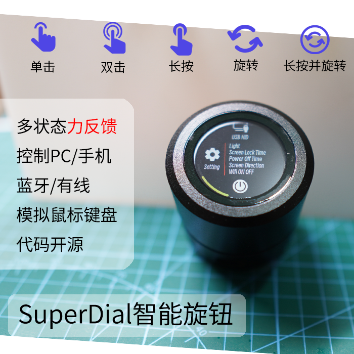
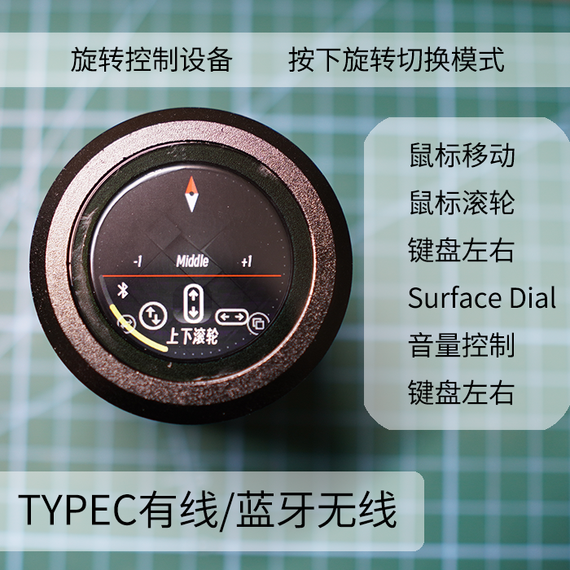
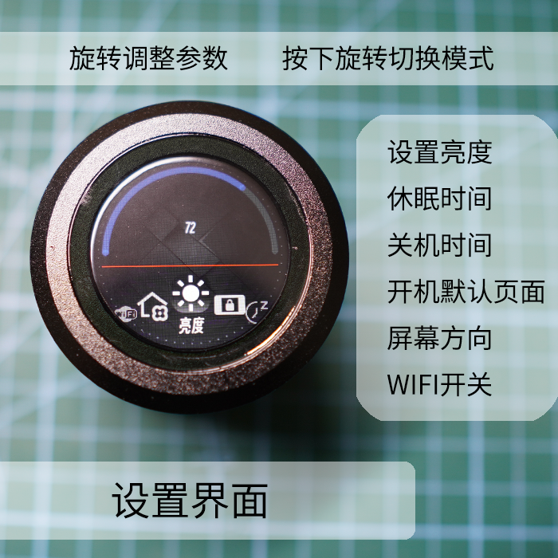
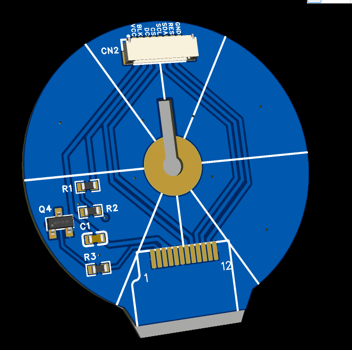
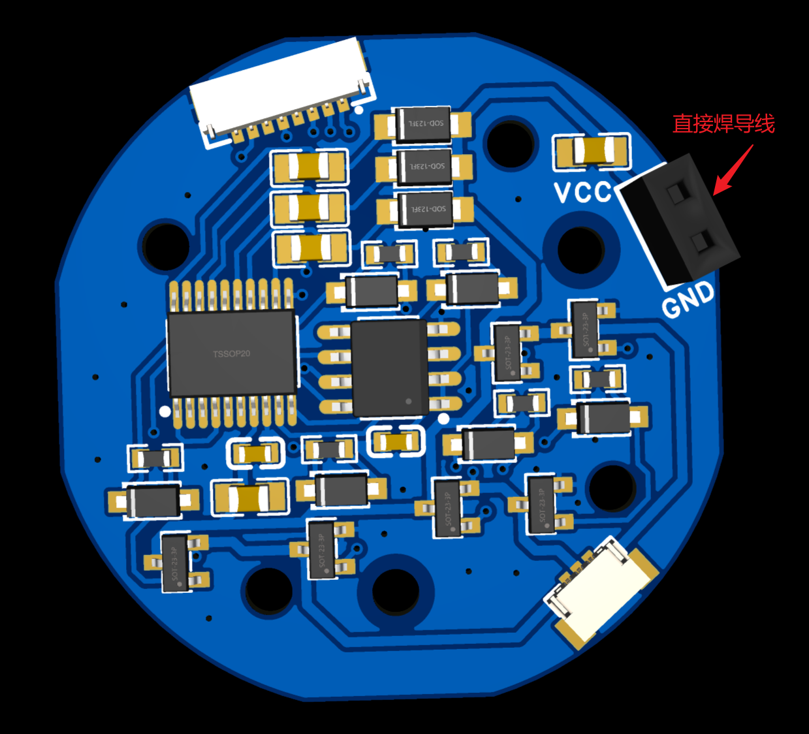
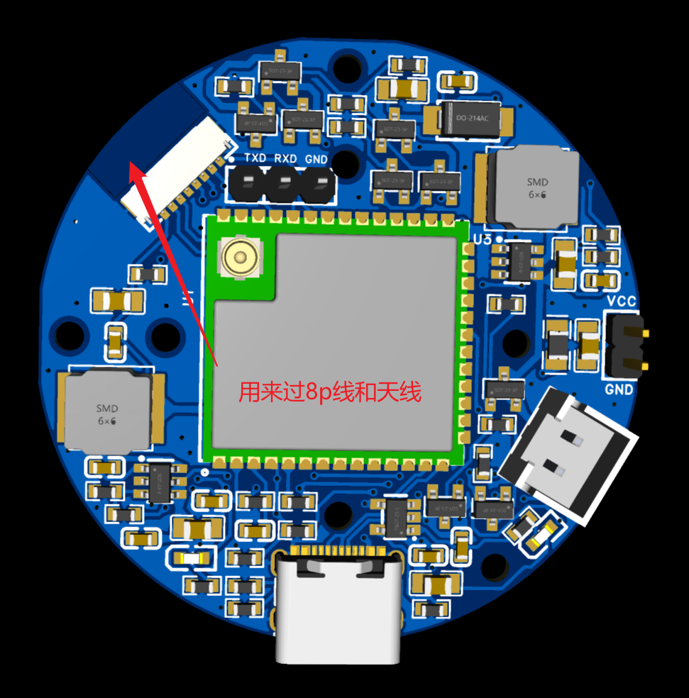
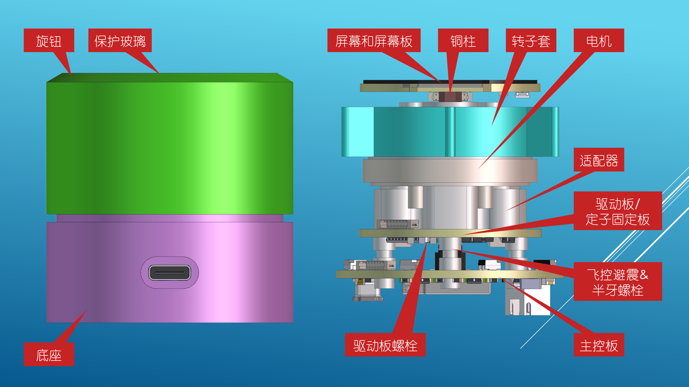
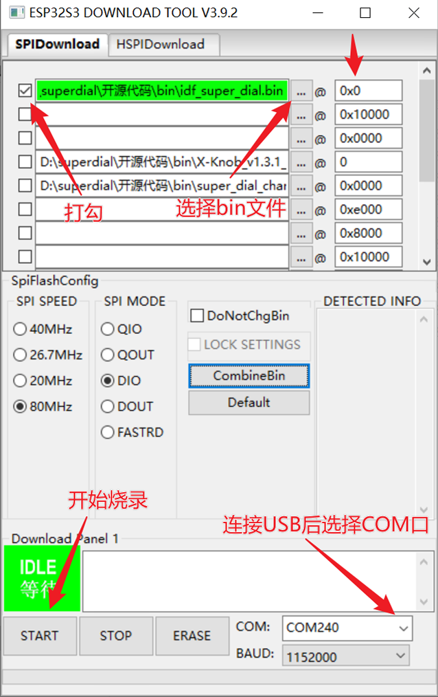
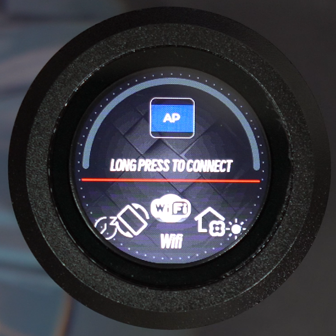
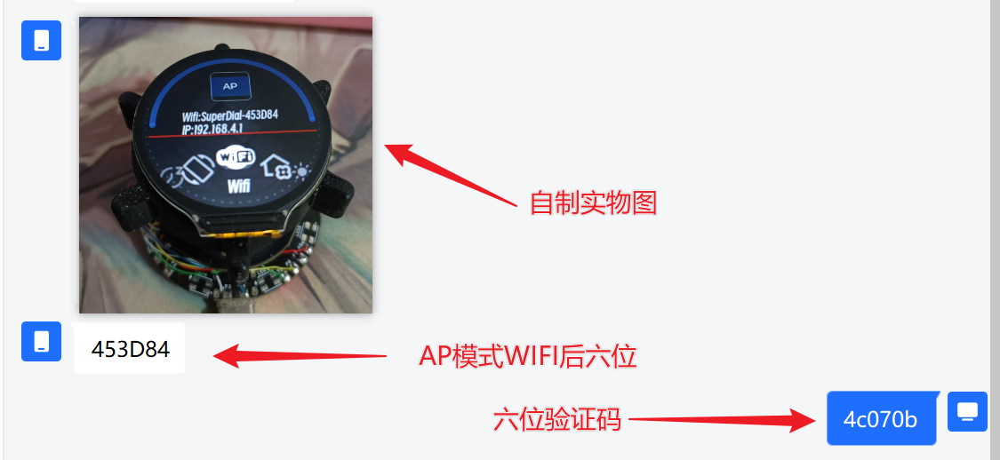

# Super Dial 电机旋钮屏
##更新日志
### **重要更新2024/1/26:**
* **3205A电机已基本无货，需要改成3205B电机，修改内容如下**
  * 电机驱动板更改定位孔
  * 电机适配器修改为适配3205B
  * 电机转子套修改为适配3205B
  * 需要购买的螺丝变动具体查看3205B的bom表
### **重要更新2023/2/10:**

* **主控板V1更新为V2（打板 `不要打V1版本了）`，修复ip5306不稳定问题导致的电机转动时芯片重启、打开esp32wifi功能时供电不稳重启。 `删除USB引脚上的电容`（V1版本的C10、C11）让USB正常工作，原因是100nf电容太大了导致USB不能正常识别，去除电容就可以**
* **优化项：更换充电芯片使充电电流限制在400mA提高电池使用寿命，设计ups电路可实现USB和电池供电不间断切换，保证USB2.0也可以正常使用**
* **新的代码+固件也一并开源至Gitee**
* 硬件应该为最终版本，不再改动。代码会继续画饼（2024年注：电机坚持了一年才没货已经挺好了，所以硬件有小改动，换了几个螺丝孔位）

2022/10/10：原理图中usb5Vin 经过ip5036 再输出5v，会导致单usb供电的时候不稳定，会让电机控制或者蓝牙无法正常工作，暂时可以使用先usb和电池一起用。问题修复中，还没打板。
2022/11/11：发现程序之前mt6701磁编码器芯片用iic通信会有延迟现象，修改主控和电机驱动板的8p线走线，变成spi模式，磁编码器检测效果变好。不会出现力度突然大突然小的情况。（程序bin会后续修改，但是目前iic的程序可以在新版pcb上使用）

2022/11/24 修改bin文件，iic  -&gt; spi（老版本主控板不支持spi固件），替换力度控制功能为双击关机     spi固件已解决力度突然大突然小的问题，但是11.10之前版本的pcb不支持spi通信

## 1.项目介绍
灵感来源与国外的smart konb，制作初衷为制作一个桌面力反馈旋钮，可以与电脑进行交互。项目从最重要的电机入手，选择了量大便宜的3205电机（小米云台电机的库存货），在结构上实现上下等大，增加实用功能蓝牙hid（滚轮功能），可实现与surface dial一样的功能。演示视频[“SuperDial电机旋钮——力反馈、多功能”](https://www.bilibili.com/video/BV1cG411c7QS)
## 2.制作说明
硬件构成esp32s3-n16r8，屏幕为gc9a01，3个pcb，4个打印件，若干结构件。具体在附件——[附件gitee链接](https://gitee.com/coll45/super-dial-motor-knob-screen)

pcb：pcb打板都是2层板，1.6厚。`在立创下单参数都为默认`，只有颜色可以修改

1. 屏幕板，中间需要焊接铜柱（铜柱尖角对准线，可以用m2.5螺丝先固定后焊接，然后取出螺丝），8p0.8线通过铜柱往下连接到主控板（穿过电机中心，铜柱固定在打印件-适配器上）　 下单屏幕板的时候注意备注： 不要半孔工艺

2.电机驱动板，含磁编码器。驱动芯片eg2133，磁编码器MT6701。穿过屏幕8p线后，驱动板通过螺丝固定在打印件-适配器上

3.主控板,固定在底座上，背面朝上，电池放底部。typec一定需要USB3.0，5V1A以上，可实现充电、单独给旋钮供电（未来可以支持usb-hid）主控板上的2.54插针都不要焊接。

## 结构说明
打印件可以通过立创的三维猴打印，直接上传`3D打印和CNC模型-by虫二`文件夹内的step即可，一共四个打印件(有一个买电机会送),忽视壁厚小于0.8mm的警告，预计一套20-30。

## 组装说明
在文件夹中有`superdial装配教程.pdf`
## 代码烧录
USB烧录方法：打开附件文件夹内的`bin/flash_download_tool_3.9.2.exe` 选择esp32s3，loadmode改成USB，选择对应的bin文件，下载到自己电脑bin文件地址会变，需要重新选（idf_superdial.bin烧录到0x0位置），USB数据线连接，选择对应的com口。点start开始烧录。烧录完成后拔掉typec 再次插入就可以看见效果

代码第一次烧录会白屏很久(大概30秒)，因为在初始化spiffs文件系统，等初始化完成以后下次重启就不会白屏那么久了

## WIFI功能说明
旋钮有验证码机制，验证后可以实现wifi页面更换背景图片\自定义快捷键\自定义力反馈

选到设置界面-wifi-AP，长按启动热点，连接SuperDial-XXXXXX的wifi，打开浏览器访问192.168.4.1，选中wifi名称，填入密码和六位验证码

验证码获取需要私聊作者QQ：674148718（请直接发消，不要加好友。或者发送邮件到674148718@qq.com）发送AP-wifi名称后六位，并发旋钮实物照片，证明是个人自制。作者会在一天之内回复六位验证码(拒绝提供验证码给闲鱼成品)

填入验证码后，切换到STA模式，连接到自己的wifi，账号密码正常的情况会出现IP地址，与wifi同一局域网下，可以使用浏览器访问对应地址即可自定义快捷键和自定义背景图片。

常见问题：
1. 验证码填入后切换到STA模式还是显示账号、密码、验证码页面，说明验证码填写错误
2. 切换到STA模式连接wifi直接重启，STA模式只能连接2.4g频段wifi，5g频段不能使用，并且2.4g和5g共用的wifi也无法使用
## 源码
已经上传至gitee，主控芯片为：esp32s3-n16r8   开发环境为idf或arduino，代码在对应名称文件夹中

推荐用idf开发，只要安装idf5.0以上版本，即可直接编译运行源码。 不推荐的是arduino开发环境，需要自行修改lvgl配置文件，比较麻烦

idf的代码开放到wifi功能之前，可以实现力反馈控制、lvgl、USB-HID、蓝牙、设置界面等，可以用于学习/参考

## 未来计划（画饼）
项目初衷是做pc的外设所以打算都是开发pc功能。有能力大佬可以在开源的基础上自行修改。

1. ~~lvgl多级菜单实现多种界面效果（但是主要还是对pc设备win10系统的操作） ~~2023/2/10已实现
2. pc性能监视器
3. ~~wifi webserver实现图片修改 ~~  2024/6/1已实现
4. 实现midi控制
5. 屏保页面，动图显示（lottie动效）
6. 智能家居

## 沟通与交流
QQ群：816782369

## 感谢与引用
非常感谢虫二和立创的星火计划，让项目能够快速迭代落地 [fywbchong2](https://space.bilibili.com/438787726)

同时也感谢xknob作者mos，idf的代码更新参考了xknob功能 [xknob-项目链接](https://github.com/SmallPond/X-Knob)

还有非常感谢乐鑫开发者[老酸菜](https://github.com/lijunru-hub)提供的帮助，在idf开发过程中很多代码都是直接沿用[esp-iot-solution](https://github.com/espressif/esp-iot-solution/tree/master)中的示例

网页ui参考了开源作者：muyan的ESP32 UPS 12V [ESP32 UPS 12V 项目链接](https://gitee.com/muyan3000/esp32-ups-12-v)